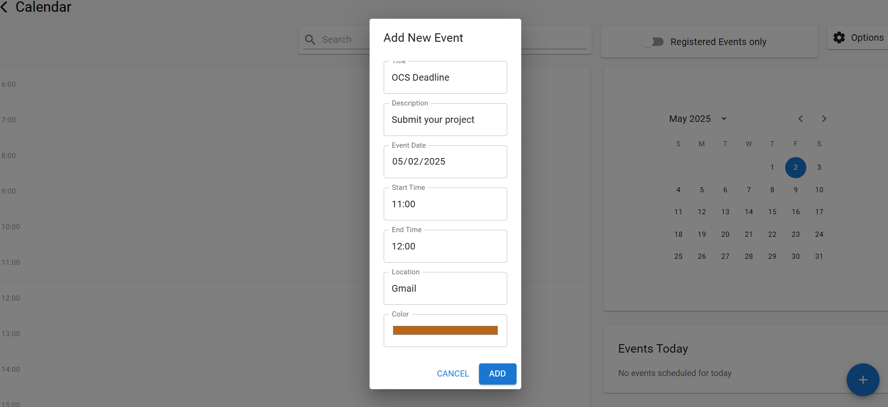

# 📅 My Calendar

A full-stack calendar web application built with **Vite.js**, **React**, **Node.js**, **Express**, **MySQL**, and **Material UI (MUI)**. It provides basic **CRUD** operations for managing events.

---

## 🚀 Features

- Add, View, Update, and Delete events
- MySQL backend integration
- Modular structure with separate frontend and backend
- Axios for HTTP requests
- Material UI for modern UI components
- Planned (but not implemented): 
  - Form validation
  - Responsive design

---

## 🛠 Tech Stack

### Frontend
- Vite.js
- React.js
- Axios
- MUI (Material-UI)

### Backend
- Node.js
- Express.js
- MySQL2
- CORS
- dotenv
- nodemon (dev)

---

## 📁 Project Structure

```
my-calendar/
├── my-calendar-backend/
│   ├── config/
│   │   └── db.js
│   ├── controllers/
│   │   └── eventController.js
│   ├── routes/
│   │   └── eventRoutes.js
│   ├── index.js
│   ├── .env
│   └── package.json
├── src/
│   ├── components/
│   │   ├── AddEvent.jsx
│   │   ├── Calendar.jsx
│   │   ├── EventDetails.jsx
│   │   ├── EventsToday.jsx
│   │   ├── Home.jsx
│   │   ├── Registered.jsx
│   │   ├── RegisteredEvents.jsx
│   │   ├── Schedule.jsx
│   │   └── SearchBar.jsx
│   ├── App.jsx
│   ├── App.css
│   ├── index.css
│   └── main.jsx
├── index.html
├── .gitignore
├── package.json
└── README.md
```

---

## ⚙️ Setup Instructions

### 1. Clone the Repository

```bash
git clone https://github.com/sanjana-adepu/my-calendar.git
cd my-calendar
```

### 2. Frontend Setup

```bash
npm install
```

Start the frontend:

```bash
npm run dev
```

### 3. Backend Setup

```bash
mkdir my-calendar-backend
cd my-calendar-backend
npm init -y
npm install express mysql2 cors dotenv
npm install --save-dev nodemon
```

Create `.env` file:

```env
DB_HOST=localhost
DB_USER=root
DB_PASSWORD=your_password
DB_NAME=mycalendar
PORT=8081
```

Create the database and table in MySQL:

```sql
CREATE DATABASE IF NOT EXISTS mycalendar;

USE mycalendar;

CREATE TABLE IF NOT EXISTS events (
  id INT AUTO_INCREMENT PRIMARY KEY,
  title VARCHAR(255) NOT NULL,
  date DATE NOT NULL,
  start_time TIME NOT NULL,
  end_time TIME NOT NULL,
  color VARCHAR(50),
  created_at TIMESTAMP DEFAULT CURRENT_TIMESTAMP
);
```

Run the backend server:

```bash
npx nodemon index.js
```

---

## 📌 Future Improvements

- ✅ Add form validation
- ✅ Improve responsive design
- ❌ Authentication (optional future feature)
- API for search bar and also "options"

---

## 📸 Screenshots

 - create an event
 - read an event
 - update an event
 - delete an event
 - calendar view and today's events
 - registered events when switched

---

## 📄 License

This project is licensed under the MIT License.
